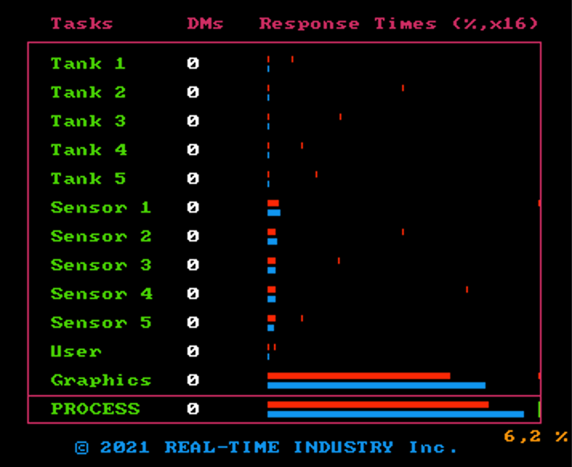

# __MyPtask Library__

### _Author_: Livio Bisogni
###### __&copy; 2021 REAL-TIME INDUSTRY Inc.__
___
An educational real-time library for stress-free time & task management.

## Prerequisites

* [CMake 3.1+](https://cmake.org) - A cross-platform, open-source build system.

## How to compile

To compile the library the first time:

1. Move the `myptask-main` folder (from now on referred to as `myptask-main/`) where thou prefer.
2. Launch a terminal window and navigate to `myptask-main/`.
3. Type:

    ```
    $ mkdir build
    $ cd build
    $ cmake ..
    $ make
    ```

## How to use

The compilation produces the library file `myptask-main/build/libmyptask.a`, which must be included in thy desired projects. Adjust the library to thy choosing.
A project that uses it is the [Tanks Simulator](https://github.com/vbisog/tanksimulator). In that repository, there is a [pdf](https://github.com/kimjong0xff/tanksimulator/blob/main/project-report.pdf), which briefly describes the project. Indeed, it describes some of the main aspects of this library, applied to a concrete case. Italian only, though (sorry folks).


